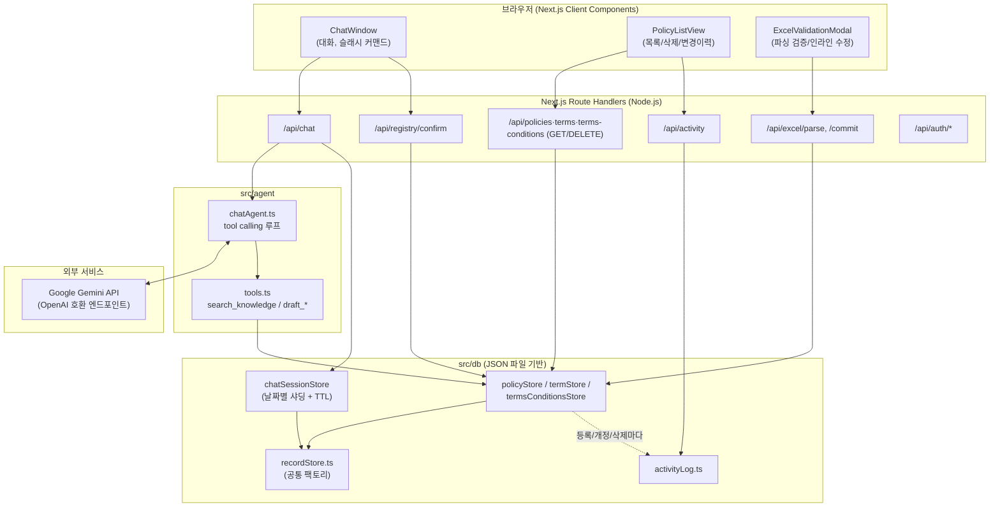

# 에이전트 설계 문서 (Architecture)

개발 시 지켜야 할 상세 규칙은 [`CLAUDE.md`](./CLAUDE.md)에, 실제 프롬프트/도구 정의는
[`PROMPTS.md`](./PROMPTS.md)에 있습니다. 이 문서는 전체 구조를 한눈에 보기 위한 개요입니다.

## 1. 목표

정책(Policies) / 표준 용어집(Terms) / 이용약관(Terms & Conditions) 3종 데이터를 메뉴 이동 없는
**단일 대화창**에서 (1) 자연어 조회, (2) 대화형 등록, (3) 엑셀 일괄 업로드/검증, (4) 목록
조회·삭제, (5) 변경 이력 확인까지 처리한다.

## 2. 전체 구성도



## 3. 주요 컴포넌트

### 3.1 프론트엔드 (`src/app/components/`)
- **`chat/ChatWindow.tsx`**: 대화 상태(표시용 메시지 목록, API용 원본 이력, `sessionId`)를 들고
  있는 클라이언트 컴포넌트. 서버는 세션을 저장하지 않으므로 매 요청마다 전체 이력을 다시
  보낸다 — 단, 대화 세션 저장(`chatSessionStore`)을 위한 `sessionId`만 서버가 발급해 추적한다.
- **`chat/SlashCommandMenu.tsx`**: `/` 입력 시 뜨는 빠른 명령 목록. 상시 노출되는 칩 UI와
  데이터 소스(`SLASH_COMMANDS`)를 공유한다.
- **`chat/ExcelValidationModal.tsx` / `ParsingValidationTable.tsx`**: 엑셀 파싱 결과를 시트 타입별
  탭으로 보여주고, 셀 인라인 수정과 행 삭제를 지원한 뒤 "일괄 등록" 시 `/api/excel/commit` 호출.
- **`policies/PolicyListView.tsx`**: 정책/용어/이용약관 목록(탭+검색+아코디언) + 삭제 + "변경
  이력" 탭(등록/수정/삭제 스냅샷).

### 3.2 에이전트 (`src/agent/`)
- **`chatAgent.ts`**: Gemini(OpenAI 호환 엔드포인트)를 tool calling으로 호출하는 루프. 최대
  6회까지 도구 호출을 반복하고, 최종 텍스트 응답과 (있다면) 확인 카드를 반환한다.
- **`tools.ts`**: 4개 도구 정의.
  - `search_knowledge`: 정책/용어/이용약관 스토어에서 토큰 매칭 검색(임베딩·벡터DB 없음).
  - `draft_policy` / `draft_term` / `draft_terms_conditions`: **DB에 쓰지 않고** 지금까지 파악한
    필드의 완성 여부(`missingFields`)만 검증한다. 실제 저장은 사용자가 확인 카드에서 "등록"을
    눌러야 `/api/registry/confirm`이 수행한다 — 에이전트가 스스로 저장을 완료할 수 없다.

### 3.3 데이터 계층 (`src/db/`)
- **`recordStore.ts`**: "JSON 파일 + 개정 이력(`history`)" 로직을 한 번만 구현한 공통 팩토리.
  `policyStore`/`termStore`/`termsConditionsStore`/`chatSessionStore`가 전부 이걸 재사용한다
  (파일 경로/중복판단 키/검색 텍스트만 다르게 주입).
- **`registry.ts`**: 등록·개정·삭제 시 각 스토어 호출 + `activityLog`에 스냅샷을 남기는 상위 함수.
- **`chatSessionStore.ts`**: 대화 세션 전용. 날짜별 파일(`data/chats/sessions-YYYY-MM-DD.json`)로
  샤딩하고, 조회 필터링 + 쓰기 시점 lazy cleanup + 1시간 주기 타이머로 보관기간
  (`CHAT_RETENTION_HOURS`, 기본 24시간)이 지난 세션을 제거한다.
- **`activityLog.ts`**: 정책/용어/이용약관의 등록/개정/삭제 이력(작업 유형, 대상, 작성자, 시각,
  전/후 스냅샷)을 한 곳에 기록한다.

### 3.4 엑셀 파서 (`src/parser/excelParser.ts`)
AI가 아니라 **결정적 규칙**만 사용한다: 시트명으로 정책/용어/이용약관을 판별하고, 헤더 별칭
사전으로 컬럼을 고정 필드에 매핑한 뒤 필수값/이넘을 검증한다. 병합 셀과 2단(그룹+세부) 헤더를
자동 감지해 실제 사내 엑셀 양식을 그대로 다룰 수 있게 했다.

### 3.5 인증 (`src/auth/`)
아이디/비밀번호(scrypt 해시) + HMAC 서명 세션 쿠키. 세션 검증은 `getCurrentUser()`가 담당하며,
어떤 이유로든 실패하면(계정 저장소 접근 오류 등) 예외를 던지는 대신 "비로그인"으로 안전하게
처리한다(`src/auth/currentUser.ts`).

## 4. 데이터 흐름

### 4.1 대화형 등록
```
사용자 입력 → /api/chat → chatAgent.runChatTurn()
  → Gemini가 draft_policy 등 도구 호출 (DB 미기록)
  → missingFields 있으면 되묻는 응답 / 없으면 확인 카드 반환
  → 사용자가 카드에서 "등록" 클릭 → /api/registry/confirm
  → registry.ts가 policyStore.create() + activityLog 기록 (author/updatedAt은 로그인 세션에서만 채움)
```

### 4.2 엑셀 업로드
```
파일 업로드 → /api/excel/parse (결정적 규칙으로 파싱+검증, DB 미기록)
  → 프론트 모달에서 인라인 수정/행 삭제
  → "일괄 등록" → /api/excel/commit → 행 단위로 재검증 후 커밋(행 하나 실패해도 나머지는 계속 진행)
```

## 5. 외부 연동 정보

| 항목 | 값 |
|---|---|
| LLM | Google Gemini `gemini-3.1-flash-lite` (무료 티어) |
| 호출 방식 | `openai` npm SDK, `baseURL`만 `https://generativelanguage.googleapis.com/v1beta/openai/`로 교체 |
| 필요 설정 | 환경변수 `GEMINI_API_KEY` ([Google AI Studio](https://aistudio.google.com/apikey)에서 발급) |
| MCP | 사용하지 않음 |
| DB / 벡터DB | 사용하지 않음 — JSON 파일(`data/knowledge/*.json`, `data/chats/*.json`) + 토큰 매칭 검색 |
| 배포 | Railway (Railpack 빌더, 영속 볼륨 `/app/data`) |

## 6. 의존성

전체 의존성은 [`package.json`](./package.json) 참고. Dockerfile은 없음 — Railway의 Railpack
빌더가 `package.json`을 보고 자동으로 빌드/실행한다(`railway.json`에 `builder: "RAILPACK"`로
명시). 오픈소스 라이선스 고지는 [`THIRD_PARTY_NOTICES.md`](./THIRD_PARTY_NOTICES.md) 참고.
